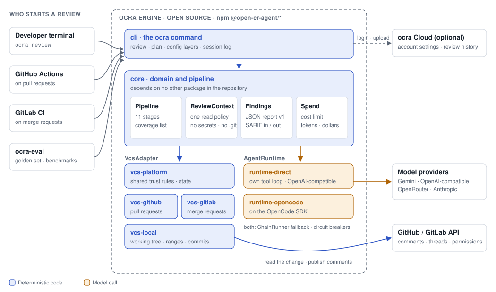
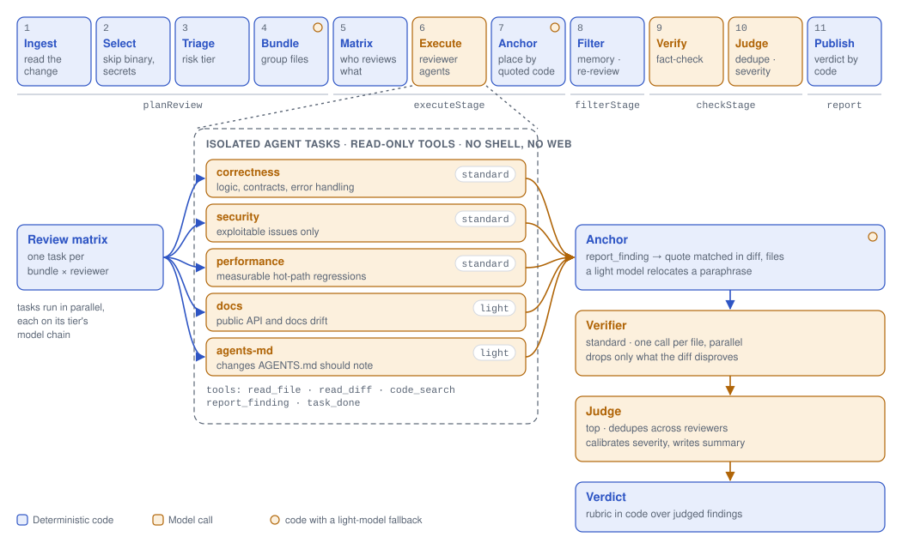

# ocra

English · [简体中文](README.zh-CN.md)

**ocra** is open-source AI code review built for pull requests you do not trust. It reviews local changes, GitHub pull requests and GitLab merge requests in your CI with your own model key, and it stays quiet unless a finding quotes the code it means and holds up on a second read.

[](https://www.npmjs.com/package/@open-cr-agent/cli)
[](https://github.com/jma49/Open-CR-Agent/actions/workflows/ci.yml)
[](LICENSE)

> **Status:** early 0.x. CLI flags, configuration keys, exit codes and the report format are [contracts](docs/manual/en/stability.mdx) and change only with notice; prompts and review quality still move ([measured quality](docs/manual/en/quality.mdx)). Manual: [ocracloud.com](https://ocracloud.com) ([English](docs/manual/en/index.mdx) · [中文](docs/manual/zh/index.mdx)).

## Why ocra

- **Hostile pull requests are the design case.** A diff, a pull request description or an `AGENTS.md` may be written by an attacker. Agents get read-only tools and no shell, and on pull requests, forks included, nothing from the reviewed tree runs. See [Security model](#security-model).
- **A second read before any comment.** A verifier drops what the code disproves, a judge merges duplicates and calibrates severity, and code, not a model, computes the verdict. Reporting nothing is a valid outcome.
- **Reviewers by domain and by file group.** Correctness, security, performance, docs and `AGENTS.md` reviewers each run as an isolated task on a group of related files. A tested planner decides which reviewer reads which group, so cost does not grow as groups × reviewers.
- **Findings follow the code across pushes.** A comment is anchored by the code it quotes, never by a line number a model made up. A finding is fixed only when that code is gone; a maintainer can dismiss it, the pull request's author cannot.
- **Cost is bounded and accounted for.** A spend limit stops starting tasks, the report names what was left unreviewed, and the next review continues there. Every model call reports tokens and dollars.
- **Built to be embedded and measured.** A versioned JSON report ([schema](docs/schema/report.v1.json)), [SARIF 2.1.0](docs/manual/en/github.mdx) out for code scanning and in from Semgrep, CodeQL and other analyzers, a public `review()` entry, and quality numbers published with their limits.

## How it works

<!-- Diagrams: scripts/lib/diagrams.mjs, both languages; regenerate with node scripts/diagrams.mjs. -->
<picture>
  <source media="(prefers-color-scheme: dark)" srcset="docs/images/system-en-dark.svg">
  
</picture>

```
 Ingest → Select → Triage → Bundle → Matrix → Execute → Anchor → Filter → Verify → Judge → Publish
 └─────────── deterministic ─────────────┘   └─ LLM ─┘  └ code ┘  └ code ┘  └ LLM ┘  └ LLM ┘  └ code ┘
```

Each (bundle, reviewer) cell is an isolated agent task that reports findings through a typed tool. Models fail over along a chain with a per-model circuit breaker; a failed task is a coverage gap in the report, not a failed run.

<picture>
  <source media="(prefers-color-scheme: dark)" srcset="docs/images/agents-en-dark.svg">
  
</picture>

Full design: [architecture](docs/architecture.md) and [decision records](docs/adr/).

## Quickstart

Requires Node.js 22.19+ and Git.

```bash
npm install -g @open-cr-agent/cli    # or run without installing: npx @open-cr-agent/cli review
export GEMINI_API_KEY="your-key"     # or ANTHROPIC_API_KEY, OPENAI_API_KEY, OPENROUTER_API_KEY
cd your-repository
ocra init                            # .ocra/config.json with models for that key
ocra review                          # uncommitted changes, including untracked files
ocra init --github                   # also .github/workflows/ocra.yml, safe for pull requests from forks
```

`ocra init` never replaces an existing file (`--force` does) and prints the next steps, such as `gh secret set` and `gh label create ocra-review` ([ocra init](docs/manual/en/cli.mdx#ocra-init)).

Other targets and options:

```bash
ocra review --from main                      # this branch since it diverged from main
ocra review --commit abc123                  # a single commit
ocra review --plan                           # files, bundles, tasks, prompt sizes, input cost; no model call
ocra review --max-cost-usd 2                 # a spend limit; the report says what it left
ocra review --format sarif --output out.sarif
ocra review --import-sarif semgrep.sarif     # an analyzer's results on the change join the review
ocra review --pr 42 --publish                # a GitHub pull request, posted as a review
ocra review --mr 7 --publish                 # a GitLab merge request
```

The `direct` runtime installs without OpenCode, the optional default: 11 MB instead of 175 MB ([Installation](docs/manual/en/installation.mdx#without-opencode)). More: [quickstart](docs/manual/en/quickstart.mdx), [Model providers](docs/manual/en/providers.mdx) (including your own OpenAI-compatible endpoint).

## In CI

**GitHub pull requests**, with the Action in [`action.yml`](action.yml): inline comments, one summary comment updated in place, and re-reviews of only what changed since the last push.

```yaml
# .github/workflows/ocra.yml
on:
  pull_request:
permissions:
  contents: read
  pull-requests: write
jobs:
  review:
    # Forks get no secrets on pull_request; see the GitHub guide.
    if: github.event.pull_request.head.repo.full_name == github.repository
    concurrency:
      group: ocra-${{ github.event.pull_request.number }}
      cancel-in-progress: true
    runs-on: ubuntu-latest
    steps:
      - uses: actions/checkout@3d3c42e5aac5ba805825da76410c181273ba90b1 # v7.0.1
        with:
          fetch-depth: 0
      - uses: jma49/Open-CR-Agent@82a3f1183a3177e9efa401d87eb95dea495ef619 # v0.6.0
        env:
          GEMINI_API_KEY: ${{ secrets.GEMINI_API_KEY }}
```

Pin the Action by commit: a tag can be moved. Outputs: `verdict`, `exit-code`, `run-id`, `findings`, `report`, and `sarif` with `sarif: true`. With `"runtime": "direct"`, `opencode: false` skips installing OpenCode. Pull requests from forks need the gated `pull_request_target` setup in the [GitHub guide](docs/manual/en/github.mdx).

**GitLab merge requests** (GitLab.com or self-managed) from a CI job: [GitLab guide](docs/manual/en/gitlab.mdx). **Any other runner**: the container image `ghcr.io/jma49/ocra:<version>` (amd64 and arm64, attested provenance, SBOM), see [Installation](docs/manual/en/installation.mdx).

## Outputs and exit codes

Each run writes `events.jsonl` and `report.json` under `.ocra/sessions/`. `--format json` prints the report; `--format sarif` prints SARIF 2.1.0.

| Exit code | Meaning |
|---|---|
| `0` | Review finished |
| `1` | A critical finding the verifier confirmed (verdict `significant_concerns`) |
| `2` | Usage error, or no review task completed |
| `3` | Review incomplete: some files were not reviewed, or only partly (a failed task, a spend limit, a reviewer that ran out of steps) |
| `130` | Interrupted |

CI must never read an incomplete review (`3`) as a pass. The verdict is advice from models that text in the change can sway: do not use it as a security gate.

## Configuration

`.ocra/config.json` in the reviewed repository, read from the base commit on pull requests. `standard` models review code, `light` ones do helper work such as grouping files, `top` judges; a list is a failback chain (or set `OCRA_MODEL_TOP`, `OCRA_MODEL_STANDARD`, `OCRA_MODEL_LIGHT`):

```json
{
  "models": {
    "top": "google/gemini-3.1-pro-preview",
    "standard": ["google/gemini-3.5-flash", "google/gemini-flash-lite-latest"],
    "light": "google/gemini-flash-lite-latest"
  },
  "concurrency": 4,
  "taskTimeoutMinutes": 10,
  "runTimeoutMinutes": 25,
  "include": [],
  "exclude": ["legacy/**"],
  "runtime": "opencode",
  "plugins": ["@acme/ocra-plugin-rules", "./tools/ocra-plugin.mjs"],
  "pluginSettings": { "acme-rules": { "team": "payments" } }
}
```

Repository guidelines come from `AGENTS.md`; path-scoped rules from `.ocra/rules.json`:

```json
{ "rules": [{ "path": "api/**", "rule": "Handlers must check tenant ownership." }] }
```

Also: `extends` shares configuration over https; `--config <file>` reads your own file instead of the repository's; `ocra memory` stops reporting accepted findings; `ocra metrics` summarizes runs, cost and findings. `ocra login` / `logout` / `whoami` connect ocra Cloud (in development): your [account settings](docs/manual/en/configuration.mdx#account-settings) apply under the repository's configuration, never providers or plugins, and findings are uploaded only when the account opts in, secrets redacted first ([CLI](docs/manual/en/cli.mdx#ocra-login-ocra-logout-ocra-whoami)). Every key: [Configuration](docs/manual/en/configuration.mdx), [Rules](docs/manual/en/rules.mdx).

## Extending ocra

What ships is built on the same contracts anyone can implement:

| Contract | What it does | Shipped implementations |
|---|---|---|
| `VcsAdapter` | Where a change comes from and where the review goes | local git, GitHub, GitLab |
| `AgentRuntime` | How one isolated review task runs | OpenCode; `direct`, a tool loop over your declared endpoints |
| Reviewer | Who reviews what, at which model tier | `correctness`, `security`, `performance`, `docs`, `agents-md` |
| Rules and tools | Path-scoped instructions; read-only tools an agent may call | `.ocra/rules.json`; `read_file`, `read_diff`, `code_search`, `report_finding` |
| Analyzers | Findings from non-model tools, as the SARIF 2.1.0 log a CI job hands over (`--import-sarif`); ocra runs no tool | tested with Semgrep's output |

A plugin is a module with a name and lifecycle hooks:

```js
export default {
  name: "acme-rules",
  configure(ctx) {
    ctx.registerRules([{ path: "services/**", rule: `Owned by ${ctx.settings.team}: check idempotency keys.` }]);
  },
};
```

Plugins run code, so they load only in local reviews, never on pull requests or under `--no-repo-config`; plugins named by an ocra Cloud account load only after `ocra plugins allow <name>@<version>`. [Plugins guide](docs/manual/en/plugins.mdx).

ocra is a library first: `review()` from `@open-cr-agent/core` runs the same pipeline from your own program; errors carry a stable code (`OcraError`), and each package's public API is recorded in [`etc/`](etc/) ([Embedding ocra](docs/manual/en/embedding.mdx)).

## Security model

Assume the reviewed code is hostile; ocra does.

- Agents have read-only tools, no shell, no web, and an environment allowlist. Secret-looking paths and `.git/` are refused in core, once, for every adapter.
- On pull requests nothing from the reviewed tree runs: no plugin, OpenCode configuration, install script or diff driver. Configuration, rules and memory come from the base commit.
- Every untrusted string in a prompt is fenced; model text in a comment cannot form a link, mention, quick action or command. Commands are accepted only from unedited comments by people with write access.
- Releases use trusted publishing with SLSA provenance, which the Action requires; the container image is attested. No code is fetched from a registry at review time, and with the `direct` runtime nothing but your model endpoint is reached.
- An adversarial golden tier plants instructions, links and commands in reviewed changes and measures what gets through.

[Security](docs/manual/en/security.mdx), [threat model](docs/manual/en/threat-model.mdx), [SECURITY.md](SECURITY.md) for private reporting.

## Quality and evaluation

Only measured numbers are published, with their limits. Today: one run on 16 golden cases on Gemini and two runs of the 10-case smoke tier on a free OpenRouter model, recall the weak point in all. Two identical runs on ten benchmark pull requests differ by 20 points of precision, so prompts stay frozen until the sample can decide changes. [Measured quality](docs/manual/en/quality.mdx).

`ocra-eval` replays [AACR-Bench](https://github.com/alibaba/aacr-bench) (200 real pull requests, 1,505 expert-verified comments) and ocra's golden set, reporting precision, recall, F1, cost and latency; `--repeat k` adds 95% confidence intervals, and `compare` calls a change better only when they separate. [Evaluation guide](docs/manual/en/evaluation.mdx).

## Where it is going

ocra aims to be the engine other review agents are built on: one shared `Finding` model, stable contracts with conformance suites, and the reference reviewer as its first customer.

| Milestone | Scope | State |
|---|---|---|
| M1–M4 | Pipeline, reviewers, GitHub, incremental re-review, failover, memory | built |
| M7–M9 | On npm with provenance; untrusted-PR hardening; GitLab, SARIF, container image, declared providers (0.2.0) | built |
| M5–M6 | A quality number that can decide changes; recall without losing precision | paused until model credit |
| M10 | Contracts: a Finding specification, a public `review()` entry, a second runtime with a conformance suite, SARIF in | mostly built; the rest paused |
| M14 | ocra Cloud ([ADR-0024](docs/adr/0024-ocra-cloud.md)): login, your own key behind a model gateway, a web view of reviews, account configuration and opt-in findings | Phase 1 built (0.5.0); frozen while users and recall come first |
| M11–M13 | Evidence (a nightly live test, per-reviewer numbers), operability (organization policy, run ids, metrics), external use | now: external use and recall (M11, M13), with `ocra init` for a one-command setup; operability paused |

Plan, reasoning and what is deliberately not built: [roadmap](docs/roadmap.md).

## Packages

Users install only `@open-cr-agent/cli`; the rest are for embedding:

| Package | Responsibility |
|---|---|
| `@open-cr-agent/core` | Domain types, pipeline, `VcsAdapter` / `AgentRuntime` / plugin contracts |
| `@open-cr-agent/runtime-opencode` | `AgentRuntime` on the OpenCode SDK |
| `@open-cr-agent/runtime-direct` | `AgentRuntime` over declared OpenAI-compatible endpoints |
| `@open-cr-agent/vcs-platform` | The review conversation platforms share |
| `@open-cr-agent/vcs-github` | `VcsAdapter` for GitHub pull requests |
| `@open-cr-agent/vcs-gitlab` | `VcsAdapter` for GitLab merge requests |
| `@open-cr-agent/vcs-local` | `VcsAdapter` for the local git repository |
| `@open-cr-agent/cloud-contract` | The wire contract with ocra Cloud |
| `@open-cr-agent/cli` | The `ocra` command |
| `@open-cr-agent/eval` | Benchmark replay and quality metrics |

## Development

```bash
git clone https://github.com/jma49/Open-CR-Agent.git
cd Open-CR-Agent && npm install && npm run build
npm link --workspace @open-cr-agent/cli   # ocra from this checkout
npm run verify                            # Biome, type check and tests (no model, no network)
```

Rules: [AGENTS.md](AGENTS.md). Releases: [CHANGELOG.md](CHANGELOG.md).

## ocra and OpenCodeReview

ocra builds on two published designs: [Cloudflare's AI code review](https://blog.cloudflare.com/ai-code-review/) (domain reviewers with "what not to flag" rules, a judging coordinator, risk tiers, model failback, incremental re-review) and Alibaba's [OpenCodeReview](https://github.com/alibaba/open-code-review) (deterministic file selection, semantic bundling, per-file-type rules, a fact-check filter, snippet anchoring, coverage manifests). Both are worth reading. Compared with OpenCodeReview, as of October 2026:

- **What ocra adds:** reviewers by domain on top of file groups, with a verifier and a judge; a threat model for hostile pull requests, including forks reviewed with secrets; re-reviews in which a finding's state follows its code; a spend limit that reports what it left; and contracts for embedding (`review()`, `VcsAdapter`, `AgentRuntime`, SARIF in and out).
- **Where OpenCodeReview fits better:** it runs inside coding agents such as Claude Code, Cursor and Codex and can use their model without a key of its own, ships as a single binary, supports Gerrit and GitFlic CI, and has been used at Alibaba's scale. ocra's quality numbers still come from small samples.

## Contributing and security

- [CONTRIBUTING.md](CONTRIBUTING.md): what helps most, setup, and what is frozen until there is credit to measure it.
- [SECURITY.md](SECURITY.md): report vulnerabilities privately, never in a public issue.
- [Code of conduct](CODE_OF_CONDUCT.md).

## License

[Apache-2.0](LICENSE)
