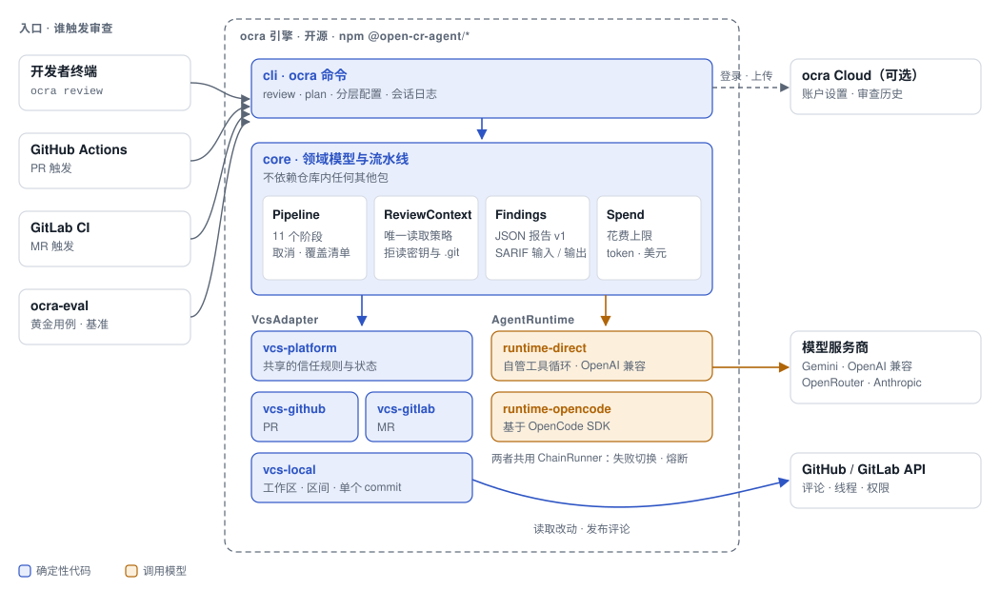
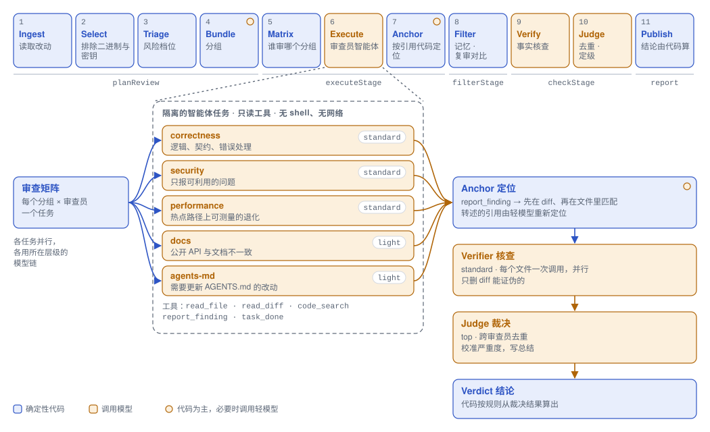

# ocra

[English](README.md) · 简体中文

**ocra** 是一个开源的 AI 代码审查工具，专为你不信任的 PR 而设计。它审查本地改动、GitHub Pull Request 和 GitLab Merge Request，用你自己的模型 key 在你的 CI 里运行；一条问题只有引用了它所指的代码、并经得起第二遍核查，才会被说出来，否则它保持安静。

[](https://www.npmjs.com/package/@open-cr-agent/cli)
[](https://github.com/jma49/Open-CR-Agent/actions/workflows/ci.yml)
[](LICENSE)

> **状态：**早期 0.x 版本。CLI 参数、配置项、退出码和报告格式是[约定](docs/manual/zh/stability.mdx)，只会在预先告知后改变；提示词和审查质量仍在变动（[质量实测](docs/manual/zh/quality.mdx)）。手册：[ocracloud.com](https://ocracloud.com)（[English](docs/manual/en/index.mdx) · [中文](docs/manual/zh/index.mdx)）。

## 为什么选择 ocra

- **恶意 PR 是设计的出发点。** diff、PR 描述、`AGENTS.md` 都可能出自攻击者之手。agent 只有只读工具、没有 shell；审查 PR（包括来自 fork 的 PR）时，被审代码树里的任何东西都不会运行。见[安全模型](#安全模型)。
- **评论之前先过第二遍。** 核查员丢掉被代码证伪的问题，Judge 合并重复并校准严重程度，结论由代码而不是模型算出。什么都不报也是正常结果。
- **按审查方向、也按文件分组。** correctness、security、performance、docs 和 `AGENTS.md` 审查员各自作为隔离任务，审查一组相关文件；由带测试的规划器决定哪个审查员读哪一组，成本不会随"组数 × 审查员数"增长。
- **问题跟着代码走。** 评论由它引用的代码锚定，从不依赖模型编造的行号。只有问题所指的代码不在了才算已修复；维护者可以驳回它，PR 作者不能。
- **成本有上限，也有账可查。** 花费上限一到就不再启动新任务，报告列出没审到的内容，下一次审查接着审。每次模型调用都报告 token 和费用。
- **可嵌入，可度量。** 带版本号的 JSON 报告（[schema](docs/schema/report.v1.json)）；[SARIF 2.1.0](docs/manual/zh/github.mdx) 可输出给代码扫描，也可从 Semgrep、CodeQL 等分析器导入；公开的 `review()` 入口；质量数字连同局限一起公开。

## 工作原理

<picture>
  <source media="(prefers-color-scheme: dark)" srcset="docs/images/system-zh-dark.svg">
  
</picture>

```
 Ingest → Select → Triage → Bundle → Matrix → Execute → Anchor → Filter → Verify → Judge → Publish
 └─────────── deterministic ─────────────┘   └─ LLM ─┘  └ code ┘  └ code ┘  └ LLM ┘  └ LLM ┘  └ code ┘
```

每个（分组，审查员）组合是一个隔离的 agent 任务，通过带类型的工具提交问题。模型沿降级链切换，每个模型都有熔断器；失败的任务在报告里记为覆盖缺口，而不是让整次运行失败。

<picture>
  <source media="(prefers-color-scheme: dark)" srcset="docs/images/agents-zh-dark.svg">
  
</picture>

完整设计：[架构](docs/architecture.md)和[决策记录](docs/adr/)。

## 快速上手

要求 Node.js 22.19+ 和 Git。

```bash
npm install -g @open-cr-agent/cli    # 或不安装直接运行：npx @open-cr-agent/cli review
export GEMINI_API_KEY="你的 key"     # 或 ANTHROPIC_API_KEY、OPENAI_API_KEY、OPENROUTER_API_KEY
cd your-repository
ocra init                            # 写入 .ocra/config.json，模型按这个 key 来选
ocra review                          # 未提交的改动，包括未跟踪的文件
ocra init --github                   # 还会写入 .github/workflows/ocra.yml，可安全审查来自 fork 的 PR
```

`ocra init` 从不替换已有文件（`--force` 会），并打印后续步骤，比如 `gh secret set` 和 `gh label create ocra-review`（[ocra init](docs/manual/zh/cli.mdx#ocra-init)）。

其他审查目标和选项：

```bash
ocra review --from main                      # 当前分支从 main 分叉以来的改动
ocra review --commit abc123                  # 单个 commit
ocra review --plan                           # 文件、分组、任务、提示词大小、输入成本；不调用模型
ocra review --max-cost-usd 2                 # 花费上限；报告会说明哪些没审到
ocra review --format sarif --output out.sarif
ocra review --import-sarif semgrep.sarif     # 把分析器在这次改动上的结果并入审查
ocra review --pr 42 --publish                # GitHub Pull Request，以评审的形式发布
ocra review --mr 7 --publish                 # GitLab Merge Request
```

`direct` 运行时可以不装默认的可选依赖 OpenCode：安装体积从 175 MB 降到 11 MB（[安装](docs/manual/zh/installation.mdx#不装-opencode)）。更多：[快速上手](docs/manual/zh/quickstart.mdx)、[模型供应商](docs/manual/zh/providers.mdx)（包括你自己的 OpenAI 兼容端点）。

## 在 CI 里

**GitHub Pull Request**，用 [`action.yml`](action.yml) 里的 Action：行内评论、一条原地更新的摘要评论，复审只看上次 push 以来的改动。

```yaml
# .github/workflows/ocra.yml
on:
  pull_request:
permissions:
  contents: read
  pull-requests: write
jobs:
  review:
    # 在 pull_request 下 fork 拿不到 secret；见 GitHub 指南。
    if: github.event.pull_request.head.repo.full_name == github.repository
    concurrency:
      group: ocra-${{ github.event.pull_request.number }}
      cancel-in-progress: true
    runs-on: ubuntu-latest
    steps:
      - uses: actions/checkout@v7
        with:
          fetch-depth: 0
      - uses: jma49/Open-CR-Agent@82a3f1183a3177e9efa401d87eb95dea495ef619 # v0.6.0
        env:
          GEMINI_API_KEY: ${{ secrets.GEMINI_API_KEY }}
```

把 Action 固定到提交：tag 可以被移动。输出：`verdict`、`exit-code`、`run-id`、`findings`、`report`，以及 `sarif: true` 时的 `sarif`。设了 `"runtime": "direct"` 时，`opencode: false` 跳过 OpenCode 的安装。来自 fork 的 PR 需要 [GitHub 指南](docs/manual/zh/github.mdx)里带门禁的 `pull_request_target` 配置。

**GitLab Merge Request**（GitLab.com 或自建实例），在 CI job 里运行：[GitLab 指南](docs/manual/zh/gitlab.mdx)。**其他任何 runner**：容器镜像 `ghcr.io/jma49/ocra:<version>`（amd64 和 arm64，带 provenance 声明和 SBOM），见[安装](docs/manual/zh/installation.mdx)。

## 输出与退出码

每次运行都会在 `.ocra/sessions/` 下写入 `events.jsonl` 和 `report.json`。`--format json` 打印报告；`--format sarif` 打印 SARIF 2.1.0。

| 退出码 | 含义 |
|---|---|
| `0` | 审查完成 |
| `1` | 有经核查确认的 critical 问题（结论 `significant_concerns`） |
| `2` | 用法错误，或没有任何审查任务完成 |
| `3` | 审查不完整：有文件没有被审查，或只审了一部分（任务失败、触及花费上限、审查员用完了步数） |
| `130` | 被中断 |

CI 绝不能把不完整的审查（`3`）当成通过。结论是模型给出的参考意见，可能被改动里的文字左右：不要把它当作安全门禁。

## 配置

被审查仓库里的 `.ocra/config.json`，审查 PR 时从 base 提交读取。`standard` 模型审查代码，`light` 模型做分组文件这类辅助工作，`top` 模型裁决；写成列表就是降级链（也可以用 `OCRA_MODEL_TOP`、`OCRA_MODEL_STANDARD`、`OCRA_MODEL_LIGHT`）：

```json
{
  "models": {
    "top": "google/gemini-3.1-pro-preview",
    "standard": ["google/gemini-3.5-flash", "google/gemini-flash-lite-latest"],
    "light": "google/gemini-flash-lite-latest"
  },
  "concurrency": 4,
  "taskTimeoutMinutes": 10,
  "runTimeoutMinutes": 25,
  "include": [],
  "exclude": ["legacy/**"],
  "runtime": "opencode",
  "plugins": ["@acme/ocra-plugin-rules", "./tools/ocra-plugin.mjs"],
  "pluginSettings": { "acme-rules": { "team": "payments" } }
}
```

仓库规范来自 `AGENTS.md`；按路径生效的规则来自 `.ocra/rules.json`：

```json
{ "rules": [{ "path": "api/**", "rule": "Handlers must check tenant ownership." }] }
```

另外：`extends` 通过 https 共享配置；`--config <file>` 改为读取你自己的文件而不是仓库里的；`ocra memory` 让已接受的问题不再报告；`ocra metrics` 汇总运行、成本和问题。`ocra login` / `logout` / `whoami` 连接 ocra Cloud（开发中）：你的[账户设置](docs/manual/zh/configuration.mdx#账户设置)放在仓库配置之下生效，从不涉及供应商和插件；只有账户开启后才上传问题，并先脱敏密钥（[CLI](docs/manual/zh/cli.mdx#ocra-loginocra-logoutocra-whoami)）。全部配置项：[配置](docs/manual/zh/configuration.mdx)、[审查规则](docs/manual/zh/rules.mdx)。

## 扩展 ocra

内置的部分基于任何人都能实现的同一套约定：

| 约定 | 做什么 | 内置实现 |
|---|---|---|
| `VcsAdapter` | 改动从哪里来，审查结果发到哪里 | 本地 git、GitHub、GitLab |
| `AgentRuntime` | 一个隔离的审查任务怎么运行 | OpenCode；`direct`，一个针对你声明的端点的工具循环 |
| 审查员 | 谁审什么、用哪个模型层级 | `correctness`、`security`、`performance`、`docs`、`agents-md` |
| 规则与工具 | 按路径生效的指令；agent 可调用的只读工具 | `.ocra/rules.json`；`read_file`、`read_diff`、`code_search`、`report_finding` |
| 分析器 | 来自非模型工具的问题，以 CI job 交来的 SARIF 2.1.0 日志导入（`--import-sarif`）；ocra 不运行任何工具 | 用 Semgrep 的输出测试过 |

插件是一个带名字和生命周期钩子的模块：

```js
export default {
  name: "acme-rules",
  configure(ctx) {
    ctx.registerRules([{ path: "services/**", rule: `Owned by ${ctx.settings.team}: check idempotency keys.` }]);
  },
};
```

插件会执行代码，所以只在本地审查时加载，审查 PR 或带 `--no-repo-config` 时从不加载；ocra Cloud 账户指定的插件只在 `ocra plugins allow <name>@<version>` 之后加载。[插件指南](docs/manual/zh/plugins.mdx)。

ocra 首先是一个库：`@open-cr-agent/core` 的 `review()` 在你自己的程序里运行同一条流水线；错误带有稳定的错误码（`OcraError`），每个包的公开 API 记录在 [`etc/`](etc/) 里（[嵌入 ocra](docs/manual/zh/embedding.mdx)）。

## 安全模型

假定被审查的代码是恶意的；ocra 就是这样假定的。

- agent 只有只读工具，没有 shell，没有网络，环境变量按白名单传入。看起来像密钥的路径和 `.git/` 在 core 里统一拒绝，对每个适配器都生效。
- 审查 PR 时，被审查代码树里的任何东西都不会运行：插件、OpenCode 配置、安装脚本、diff 驱动都不会。配置、规则和 memory 都来自 base 提交。
- 提示词里的每一段不可信字符串都有围栏；评论里的模型文本无法形成链接、@ 提及、快捷操作或命令。命令只接受有写权限的人未经编辑的评论。
- 发布使用 trusted publishing 和 SLSA provenance，Action 要求必须有；容器镜像带有来源声明。审查时不从任何 registry 拉取代码，用 `direct` 运行时只会访问你的模型端点。
- 一组对抗性黄金用例会在被审查的改动里埋入指令、链接和命令，衡量有多少能穿透。

[安全与隐私](docs/manual/zh/security.mdx)、[威胁模型](docs/manual/zh/threat-model.mdx)，私下报告漏洞见 [SECURITY.md](SECURITY.md)。

## 质量与评测

只公开实际测过的数字，并附上局限。目前：16 个黄金用例在 Gemini 上跑了一次，10 个用例的 smoke 档在一个 OpenRouter 免费模型上跑了两次，召回率每次都是短板。在十个基准 PR 上做两次完全相同的运行，精确率相差 20 个百分点，所以在样本能判定改动好坏之前，提示词保持冻结。[质量实测](docs/manual/zh/quality.mdx)。

`ocra-eval` 回放 [AACR-Bench](https://github.com/alibaba/aacr-bench)（200 个真实 PR，1,505 条经专家核实的评论）和 ocra 自己的黄金用例，报告精确率、召回率、F1、成本和延迟；`--repeat k` 给出 95% 置信区间，`compare` 只在区间分开时才判定改动更好。[评测指南](docs/manual/zh/evaluation.mdx)。

## 未来方向

ocra 的目标是成为其他审查 agent 赖以构建的引擎：一个共享的 `Finding` 模型、带一致性测试的稳定约定，参考审查员是它的第一个用户。

| 里程碑 | 范围 | 状态 |
|---|---|---|
| M1–M4 | 流水线、审查员、GitHub、增量复审、降级、memory | 已完成 |
| M7–M9 | 带 provenance 发布到 npm；不信任 PR 的加固；GitLab、SARIF、容器镜像、声明式供应商（0.2.0） | 已完成 |
| M5–M6 | 一个能判定改动好坏的质量数字；在不损失精确率的前提下提高召回率 | 暂停，等待模型额度 |
| M10 | 约定：Finding 规范、公开的 `review()` 入口、带一致性测试的第二个运行时、SARIF 导入 | 大部分已完成；其余暂停 |
| M14 | ocra Cloud（[ADR-0024](docs/adr/0024-ocra-cloud.md)）：登录、你自己的 key 经模型网关使用、审查的网页视图、账户配置和可选开启的问题上传 | 第一阶段已完成（0.5.0）；冻结，先做用户和召回率 |
| M11–M13 | 证据（每晚的真实测试、按审查员的数字）、可运维性（组织策略、运行 id、指标）、外部使用 | 进行中：外部使用和召回率（M11、M13），`ocra init` 提供一条命令的配置；可运维性暂停 |

计划、理由和有意不做的事：[路线图](docs/roadmap.md)。

## 包

用户只需安装 `@open-cr-agent/cli`；其余的包供嵌入使用：

| 包 | 职责 |
|---|---|
| `@open-cr-agent/core` | 领域类型、流水线、`VcsAdapter` / `AgentRuntime` / 插件约定 |
| `@open-cr-agent/runtime-opencode` | 基于 OpenCode SDK 的 `AgentRuntime` |
| `@open-cr-agent/runtime-direct` | 基于声明的 OpenAI 兼容端点的 `AgentRuntime` |
| `@open-cr-agent/vcs-platform` | 各平台共享的审查对话 |
| `@open-cr-agent/vcs-github` | GitHub Pull Request 的 `VcsAdapter` |
| `@open-cr-agent/vcs-gitlab` | GitLab Merge Request 的 `VcsAdapter` |
| `@open-cr-agent/vcs-local` | 本地 git 仓库的 `VcsAdapter` |
| `@open-cr-agent/cloud-contract` | 与 ocra Cloud 的通信约定 |
| `@open-cr-agent/cli` | `ocra` 命令 |
| `@open-cr-agent/eval` | 基准回放与质量指标 |

## 开发

```bash
git clone https://github.com/jma49/Open-CR-Agent.git
cd Open-CR-Agent && npm install && npm run build
npm link --workspace @open-cr-agent/cli   # 让 ocra 指向这个检出目录
npm run verify                            # Biome、类型检查和测试（不调用模型，不访问网络）
```

规则：[AGENTS.md](AGENTS.md)。发布：[CHANGELOG.md](CHANGELOG.md)。

## ocra 与 OpenCodeReview

ocra 建立在两份公开的设计之上：[Cloudflare 的 AI 代码审查](https://blog.cloudflare.com/ai-code-review/)（带"不该报什么"规则的专项审查员、负责裁决的协调者、风险分档、模型降级、增量复审）和阿里巴巴的 [OpenCodeReview](https://github.com/alibaba/open-code-review)（确定性的文件选择、语义分组、按文件类型的规则、事实核查过滤、按代码片段定位、覆盖清单）。两者都值得一读。与 OpenCodeReview 相比（截至 2026 年 10 月）：

- **ocra 多了什么：** 在文件分组之上再按审查方向分工，并有核查员和 Judge；针对恶意 PR 的威胁模型，包括带 secret 审查来自 fork 的 PR；复审时问题的状态跟着代码走；花费上限及其未审内容报告；可供嵌入的契约（`review()`、`VcsAdapter`、`AgentRuntime`、SARIF 输入与输出）。
- **OpenCodeReview 更合适的场景：** 它能在 Claude Code、Cursor、Codex 等编程 agent 里运行，可以直接用它们的模型而无需自己的 key；以单个二进制文件发布；支持 Gerrit 和 GitFlic CI；并经过了阿里巴巴规模的使用。ocra 的质量数字仍来自小样本。

## 贡献与安全

- [CONTRIBUTING.md](CONTRIBUTING.md)：什么贡献最有帮助、如何搭建环境，以及在有额度衡量之前哪些部分保持冻结。
- [SECURITY.md](SECURITY.md)：请私下报告漏洞，不要发公开 issue。
- [行为准则](CODE_OF_CONDUCT.md)。

## 许可证

[Apache-2.0](LICENSE)
